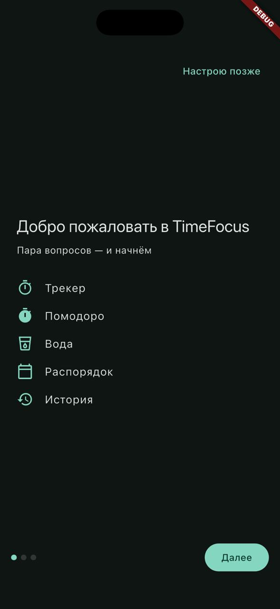
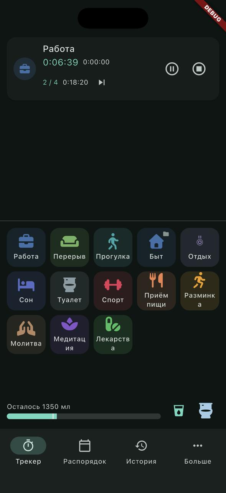
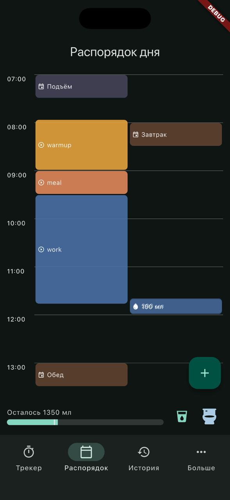
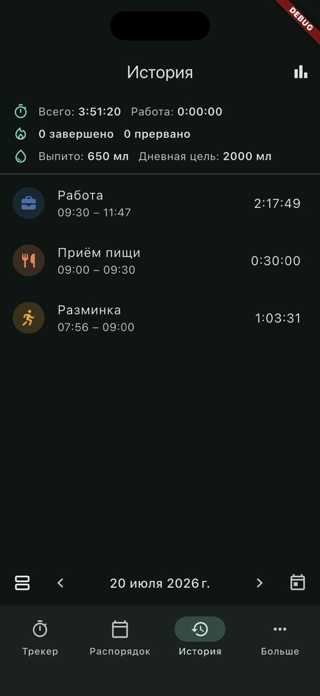
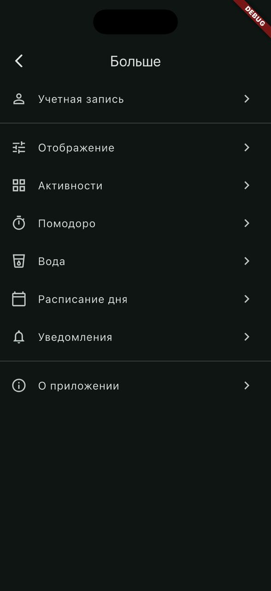

# TimeFocus

Мобильное приложение для гармонизации продуктивности и здоровья: трекер времени + Помодоро +
трекер воды + расписание дня — в единой системе, без конфликтов между модулями, полностью
offline-first.


## Скриншоты

| Онбординг | Трекер | Расписание | История | Настройки |
|---|---|---|---|---|
|  |  |  |  |  |

## Возможности

- **Трекер активностей** — сетка иконок, старт/пауза/стоп в один тап, параллельный трекинг
  нескольких активностей, группы активностей.
- **Помодоро** — циклы работа/перерыв с настраиваемыми длительностями, автопереходы,
  short/long перерыв по номеру цикла, действие после завершения серии.
- **Вода и HUD** — постоянная HUD-панель с полоской выпитого/цели, быстрый лог одним тапом,
  напоминания в режиме «интервал» или «по расписанию», контекстная иконка
  (туалет > еда > спорт > сон) по приоритету.
- **Расписание дня** — таймлайн план/факт с параллельными дорожками, строгие события
  (принудительно прерывают Помодоро точно в срок) и гибкие (ждут конца интервала).
- **Уведомления** — единая система на 9 типов событий, корректная обработка холодного старта
  приложения по тапу на уведомление, очередь отложенных уведомлений, мьют во время сна.
- **История и отчёты** — режимы день/неделя/месяц/период, редактирование интервалов с
  проверкой пересечений, графики по времени и воде (fl_chart).
- **Настройки** — тема/язык мгновенно применяются без перезапуска, полный редактор
  активностей, версионируемые настройки Помодоро/воды/расписания.
- **Онбординг** — пропускаемый первый запуск, полностью рабочее приложение сразу после skip.

Полный список пользовательских историй и приёмочных критериев — в
[specs/001-timefocus-mvp/spec.md](specs/001-timefocus-mvp/spec.md).

## Технологии

| Категория | Пакеты |
|---|---|
| Состояние | `flutter_bloc`, `bloc_concurrency` |
| БД (offline-first) | `drift`, `sqlite3_flutter_libs` |
| DI | `get_it`, `injectable` |
| Модели | `freezed`, `json_serializable` |
| Навигация | `go_router` |
| Уведомления | `flutter_local_notifications`, `timezone`, `flutter_timezone` |
| Разрешения | `permission_handler`, `app_settings`, `device_info_plus` |
| UI | `font_awesome_flutter`, `fl_chart`, `toastification` |
| Утилиты | `logger`, `vibration`, `url_launcher`, `share_plus`, `package_info_plus` |
| Тесты | `bloc_test`, `mocktail` |

Собственный `Result<T>` вместо `dartz`/`rxdart`/`either_dart`.

## Архитектура

Feature First + Clean Architecture: каждая фича — `data/` (DAO-обёртки, мапперы,
репозитории), `domain/` (сущности, интерфейсы репозиториев, usecase-ы, только чистый Dart),
`presentation/` (Bloc/Cubit, страницы, виджеты). Координация между глобальными
Bloc/Cubit — только через `RootBlocListener`, Bloc не импортирует другой Bloc.

Подробнее — [doc/architecture.md](doc/architecture.md) и
[CLAUDE.md](CLAUDE.md) (для разработки с AI-агентами).

## Быстрый старт

```bash
git clone https://github.com/KsArt-IT/TimeFocus-Flutter-SDD.git
cd TimeFocus-Flutter-SDD/app

flutter pub get
dart run build_runner build --delete-conflicting-outputs   # freezed / injectable / drift / l10n
flutter analyze
flutter test
flutter run
```

Требования: Flutter stable (Dart SDK ^3.12), Xcode (для iOS) или Android SDK.

## Структура проекта

```
app/lib/
├── core/       # DI, роутер, тема, Result<T>, ошибки, утилиты
├── shared/     # переиспользуемое между фичами: БД (Drift), энумы, общие виджеты
├── app/        # оболочка: MultiBlocProvider, RootBlocListener, shell (HUD + навигация)
└── features/   # tracker · pomodoro · water · schedule · history · settings
                # · notifications · onboarding — каждая со своими data/domain/presentation
```

## Документация

- [doc/architecture.md](doc/architecture.md) — слои, потоки данных, координация Bloc-ов
- [doc/features.md](doc/features.md) — модули приложения и ключевые бизнес-правила
- [specs/001-timefocus-mvp/](specs/001-timefocus-mvp/) — полная спецификация: user stories,
  модель данных, контракты, тест-план (`quickstart.md`), список задач (`tasks.md`)
- [CLAUDE.md](CLAUDE.md) — соглашения кодовой базы для разработки с AI-агентами

## License

MIT license. See the [LICENSE](https://github.com/KsArt-IT/TimeFocus-Flutter-SDD?tab=MIT-1-ov-file) file for details.
